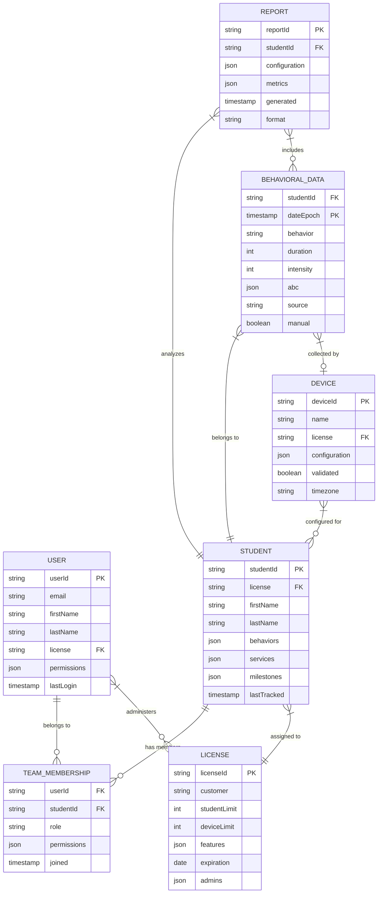

# Conceptual Data Model

## Overview

The MyTapTrack system manages behavioral tracking data for educational and therapeutic environments. The conceptual data model represents the core business entities and their relationships from a domain perspective, independent of technical implementation details.

## Core Entities

### User
Represents individuals who interact with the system in various roles (teachers, therapists, administrators, parents).

**Key Attributes:**
- User identity and authentication details
- Personal information (name, email, location)
- Role-based permissions and restrictions
- License associations
- Team memberships and invitations

**Business Rules:**
- Users must be associated with at least one license
- Users can have different permission levels per student
- Users can belong to multiple teams across different students

### Student
The central entity representing individuals whose behavior is being tracked and analyzed.

**Key Attributes:**
- Personal identification information (encrypted)
- Behavioral definitions and tracking configurations
- Service tracking and goals
- Academic schedules and milestones
- Document attachments
- Team member associations

**Business Rules:**
- Students must be associated with a valid license
- Students can have multiple team members with different roles
- Student data is subject to strict privacy and retention policies

### License
Represents the subscription and feature entitlements for organizations using the system.

**Key Attributes:**
- Customer organization information
- Subscription limits (student count, device count, app limits)
- Feature flags and capabilities
- Expiration dates and renewal information
- Administrative user assignments
- Template configurations

**Business Rules:**
- Licenses define the scope of system usage
- Feature availability is controlled by license configuration
- License limits are enforced across all associated entities

### Device
Physical or virtual devices used to collect behavioral data in real-time.

**Key Attributes:**
- Device serial number and identification
- Configuration for behavioral event mapping
- Student associations and multi-student support
- Timezone and operational settings
- Validation status and setup completion

**Business Rules:**
- Devices can be associated with multiple students
- Device configurations are student-specific
- Device data collection requires proper validation and setup

### Behavioral Data
Time-series data representing tracked behaviors, responses, and contextual information.

**Key Attributes:**
- Timestamp and duration information
- Behavior type and intensity measurements
- Antecedent-Behavior-Consequence (ABC) data
- Source device and manual entry tracking
- Data quality and validation flags

**Business Rules:**
- All behavioral data must be associated with a valid student
- Data retention follows license-specific policies
- Data can be excluded from reports while maintaining audit trails

### Reports
Aggregated views and analyses of behavioral data for decision-making.

**Key Attributes:**
- Report configuration and parameters
- Time range and data filtering criteria
- Visualization settings and preferences
- Scheduled generation and distribution
- Export formats and sharing permissions

**Business Rules:**
- Reports respect user permission levels
- Report data reflects current exclusion settings
- Historical reports maintain consistency with generation-time configurations

## Entity Relationships

### User-Student Relationships
- **Team Membership**: Users can be team members for multiple students with role-based permissions
- **Data Access**: User permissions determine what student data can be accessed and modified
- **Notification Subscriptions**: Users can subscribe to specific behavioral events per student

### Student-License Relationships
- **License Assignment**: Each student must be associated with a valid license
- **Feature Inheritance**: Students inherit available features from their associated license
- **Usage Tracking**: Student activity counts against license limits

### Device-Student Relationships
- **Multi-Student Support**: Devices can be configured for multiple students
- **Student-Specific Configuration**: Each student has unique device behavior mappings
- **Data Attribution**: Device-generated data is properly attributed to the active student

### Data-Student Relationships
- **Ownership**: All behavioral data belongs to a specific student
- **Temporal Organization**: Data is organized by time periods for efficient querying
- **Contextual Linking**: Data includes references to devices, behaviors, and environmental factors

## Data Classification

### Personally Identifiable Information (PII)
- Student names and identification
- User contact information
- Device location data
- Detailed behavioral descriptions

**Storage**: Encrypted in primary table with strict access controls

### Protected Health Information (PHI)
- Behavioral tracking data
- Medical or therapeutic notes
- Service delivery records
- Assessment results

**Storage**: Encrypted in data table with audit logging

### Configuration Data
- System settings and preferences
- Device configurations
- Report definitions
- License parameters

**Storage**: Standard encryption with role-based access

### Operational Data
- System logs and metrics
- Usage statistics
- Performance data
- Audit trails

**Storage**: Standard security with retention policies

## Data Governance Principles

### Privacy by Design
- Minimal data collection aligned with functional requirements
- Purpose limitation ensuring data use matches collection intent
- Data minimization through automated retention policies
- Consent management for data sharing and processing

### Security Controls
- Encryption at rest and in transit for all sensitive data
- Role-based access control with principle of least privilege
- Audit logging for all data access and modifications
- Regular security assessments and compliance validation

### Data Quality
- Validation rules at point of entry
- Consistency checks across related entities
- Data lineage tracking for behavioral measurements
- Error detection and correction workflows

### Retention and Lifecycle
- License-specific retention periods
- Automated data archival and deletion
- Export capabilities for data portability
- Compliance with educational and healthcare regulations

## Conceptual Model Diagram

This conceptual model provides the foundation for understanding the business domain and serves as the basis for the logical and physical data models that follow.