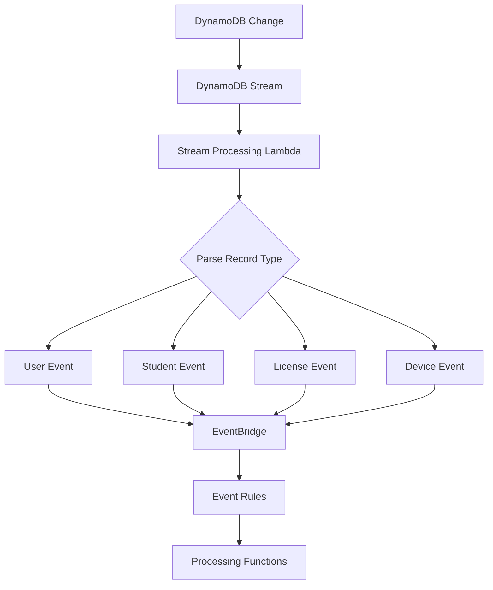
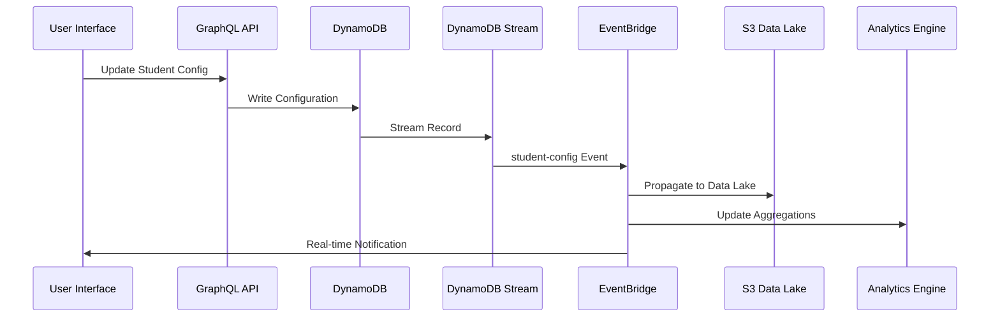
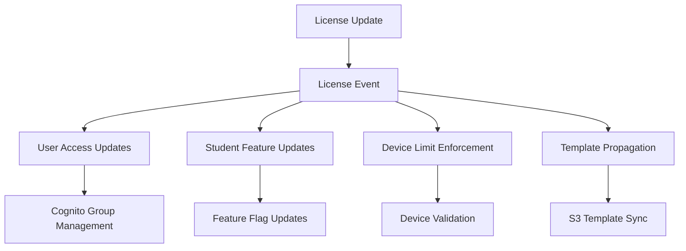
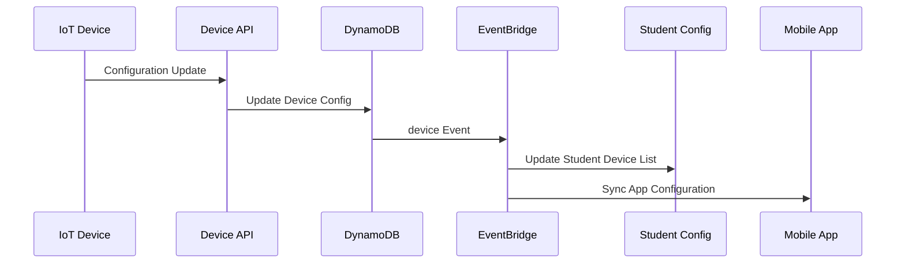
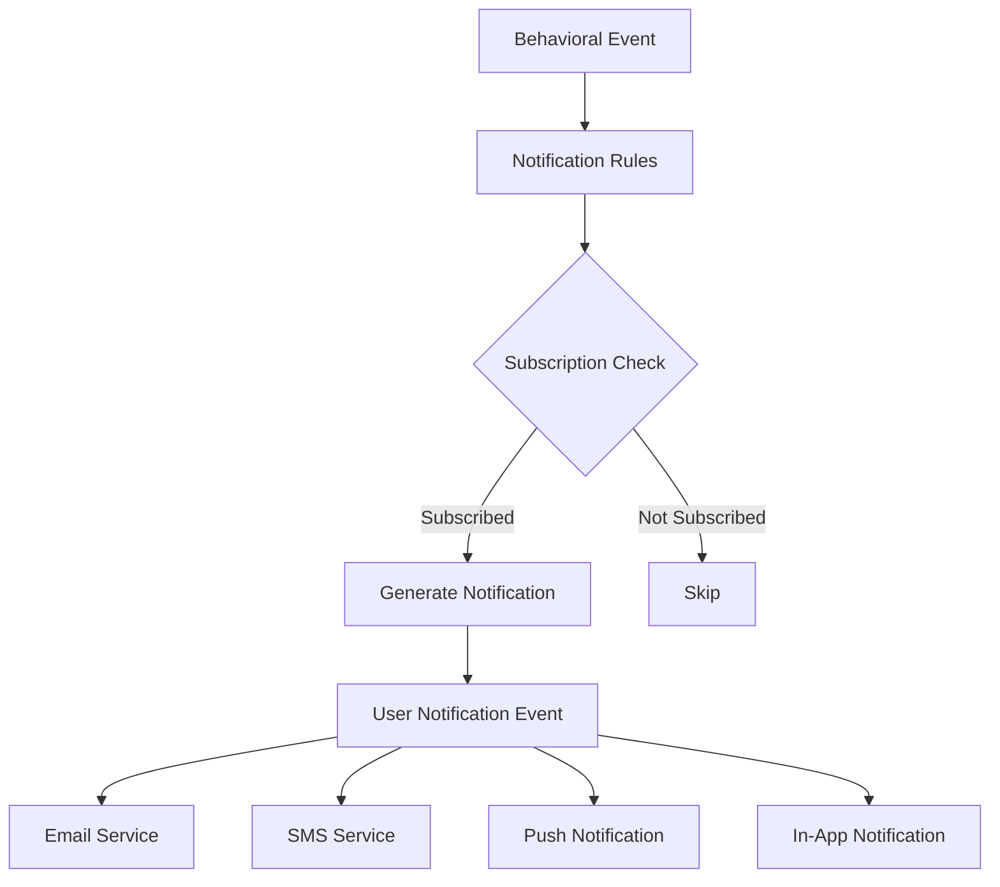
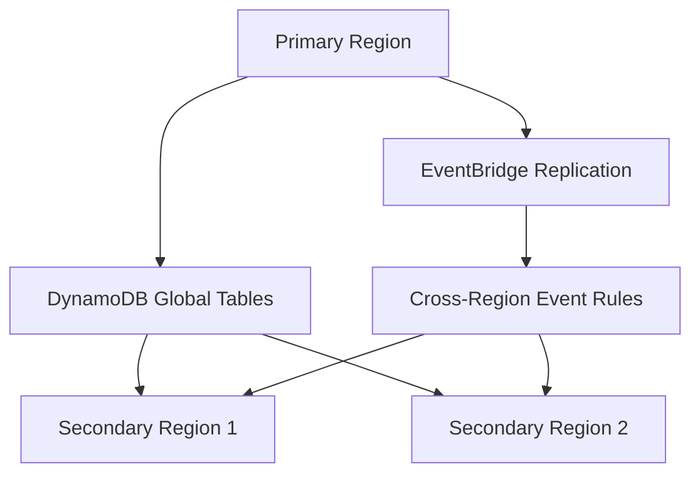
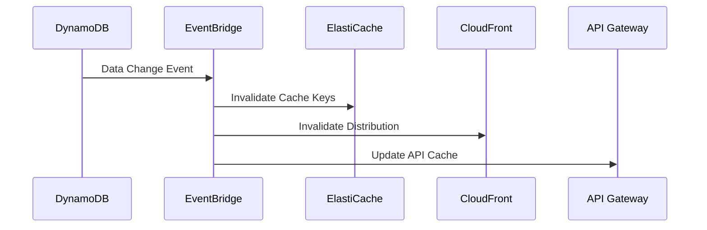

# Data Flow and Propagation Patterns

## Overview

MyTapTrack implements a sophisticated event-driven data propagation system using AWS EventBridge to maintain data consistency, trigger real-time updates, and support analytics workflows. This document describes the data flow patterns, event processing architecture, and propagation mechanisms.

## Event-Driven Architecture

### Core Components

#### DynamoDB Streams
- **Primary Table Stream**: Captures changes to PII and sensitive data
- **Data Table Stream**: Captures changes to configuration and behavioral data
- **Stream Processing**: Lambda functions process stream records in near real-time
- **Event Generation**: Stream changes are converted to structured EventBridge events

#### EventBridge Event Bus
- **Custom Event Bus**: `mytaptrack-{env}-data-events`
- **Event Routing**: Rules-based routing to appropriate processing functions
- **Event Filtering**: Selective processing based on event types and attributes
- **Dead Letter Queues**: Error handling and retry mechanisms

#### Processing Functions
- **Data Propagation**: Synchronize data across different storage systems
- **Notification Processing**: Generate user notifications and alerts
- **Analytics Updates**: Update aggregated data and metrics
- **External Integrations**: Sync with third-party systems

## Event Types and Patterns

### Event Classification

#### Entity Change Events
Events triggered by changes to core entities in the system.

```typescript
enum MttEventType {
    user = 'user',                    // User profile changes
    student = 'student-config',       // Student configuration changes
    license = 'license',              // License modifications
    team = 'team',                    // Team membership changes
    device = 'device',                // Device configuration changes
    behavioral = 'behavioral-data',   // Behavioral data updates
    notification = 'user-notification' // Notification events
}
```

#### Event Structure
```typescript
interface MttUpdateEvent<T> {
    type: MttEventType;
    data: {
        new?: T;      // New version of the entity (for INSERT/UPDATE)
        old?: T;      // Previous version of the entity (for UPDATE/DELETE)
    };
}
```

### Event Generation Patterns

#### DynamoDB Stream to EventBridge


#### Key Pattern Matching
The stream processing function uses partition key (PK) and sort key (SK) patterns to determine event types:

```typescript
// User events
if (data.pk.match(/^U\#[0-9|a-z|\-]+$/)) {
    if (data.sk == 'P') {
        type = MttEventType.user;           // User profile
    } else if (data.sk.match(/^S#[0-9|a-z|\-]+#P$/)) {
        type = MttEventType.team;           // Team membership
    } else if (data.sk.match(/^S#[0-9|a-z|\-]+#NS$/)) {
        type = MttEventType.ns;             // Notification settings
    }
}

// Student events
else if (data.pk.match(/^S\#[0-9|a-z|\-]+$/)) {
    if (data.sk == 'P') {
        type = MttEventType.student;        // Student PII
    } else if (data.sk == 'C') {
        type = MttEventType.student;        // Student config
    }
}

// License events
else if (data.pk == 'L' && data.sk.startsWith('P#')) {
    type = MttEventType.license;            // License changes
}
```

## Data Propagation Workflows

### Student Data Propagation

#### Student Configuration Changes


#### Processing Functions
1. **Student to S3**: Exports student data to S3 data lake for analytics
2. **Student to App**: Updates mobile app configurations
3. **Student Notifications**: Triggers team member notifications
4. **Student Analytics**: Updates behavioral analytics and reports

### License Management Propagation

#### License Changes Impact


#### Cascade Processing
```typescript
// License to User propagation
export async function handler(event: EventBridgeEvent<'license', MttUpdateEvent<LicenseStorage>>) {
    const oldLicense = event.detail.data.old;
    const newLicense = event.detail.data.new;
    
    // Determine admin changes
    const actions = await getActions(oldLicense, newLicense);
    
    // Add new admins to Cognito groups
    for (let email of actions.addIds) {
        await modifyUser(newLicense, email, true);
    }
    
    // Remove former admins from Cognito groups
    for (let email of actions.removeIds) {
        await modifyUser(oldLicense, email, false);
    }
}
```

### Device Data Propagation

#### Device Configuration Flow


### Notification Propagation

#### Real-time Notification Flow


#### Notification Processing
```typescript
export async function handler(event: EventBridgeEvent<'user-notification', MttUpdateEvent<UserStudentNotificationStorage>>) {
    const newRecord = event.detail.data.new;
    const oldRecord = event.detail.data.old;
    const record = newRecord ?? oldRecord;
    
    const user = await UserDal.getUserConfig(record.userId);
    
    if (newRecord?.userId) {
        // Add notification count
        await UserDal.updateUserEvent(userId, {
            studentId: record.studentId,
            awaitingResponse: false,
            count: 1
        });
    } else if (!newRecord?.userId) {
        // Remove notification count
        const eventIndex = user.events.findIndex(e => e.studentId == record.studentId);
        if (eventIndex >= 0) {
            const event = user.events[eventIndex];
            event.count -= 1;
            await UserDal.updateUserEvent(userId, event, eventIndex);
        }
    }
}
```

## Data Lake Integration

### S3 Data Lake Architecture

#### Data Organization
```
s3://mytaptrack-{env}-data/
├── students/
│   ├── year=2024/
│   │   ├── month=10/
│   │   │   ├── day=14/
│   │   │   │   └── student-{id}-{timestamp}.json
├── behavioral-data/
│   ├── year=2024/
│   │   ├── month=10/
│   │   │   ├── day=14/
│   │   │   │   └── behavior-{student-id}-{timestamp}.json
├── devices/
│   ├── year=2024/
│   │   ├── month=10/
│   │   │   └── device-{id}-{timestamp}.json
└── licenses/
    ├── year=2024/
    │   ├── month=10/
    │   │   └── license-{id}-{timestamp}.json
```

#### Data Export Process
```typescript
export async function handler(event: EventBridgeEvent<'student-config', MttUpdateEvent<StudentConfigStorage>>) {
    const student = event.detail.data.new ?? event.detail.data.old;
    
    // Generate S3 key with partitioning
    const now = new Date();
    const key = `students/year=${now.getFullYear()}/month=${now.getMonth() + 1}/day=${now.getDate()}/student-${student.studentId}-${now.getTime()}.json`;
    
    // Export to S3
    await s3.send(new PutObjectCommand({
        Bucket: process.env.DataBucket,
        Key: key,
        Body: JSON.stringify(student),
        ContentType: 'application/json'
    }));
}
```

## Real-time Data Synchronization

### Multi-Region Synchronization

#### Cross-Region Replication


#### Conflict Resolution
- **Last Writer Wins**: DynamoDB Global Tables default behavior
- **Version-based Resolution**: Application-level conflict detection using version numbers
- **Timestamp Ordering**: Event ordering based on creation timestamps
- **Manual Resolution**: Administrative tools for complex conflicts

### Cache Invalidation

#### Cache Update Patterns


## Performance Optimization

### Batch Processing

#### Event Batching
- **Batch Size**: Maximum 10 events per EventBridge PutEvents call
- **Batch Timeout**: 5-second timeout for batch accumulation
- **Error Handling**: Individual event retry on batch failures
- **Dead Letter Queues**: Failed events routed to DLQ for investigation

#### Bulk Data Operations
```typescript
// Batch processing for large datasets
export async function reprocessStudents() {
    let token;
    do {
        const output = await dynamodb.send(new ScanCommand({
            TableName: process.env.DataTable,
            ExclusiveStartKey: token,
            Limit: 10  // Process in small batches
        }));
        
        token = output.LastEvaluatedKey;
        
        // Process batch in parallel
        await Promise.all(output.Items.map(async config => {
            if (config.sk == 'P' && config.pk.match(/^S\#[0-9|a-z|\-]+$/)) {
                await processStudentConfig(config);
            }
        }));
    } while (token);
}
```

### Event Filtering

#### Rule-based Filtering
```json
{
  "Rules": [
    {
      "Name": "StudentConfigChanges",
      "EventPattern": {
        "source": ["DynamoDB"],
        "detail-type": ["student-config"],
        "detail": {
          "type": ["student"]
        }
      },
      "Targets": [
        {
          "Id": "StudentToS3",
          "Arn": "arn:aws:lambda:region:account:function:studentToS3"
        }
      ]
    }
  ]
}
```

#### Content-based Filtering
- **Field-level Filtering**: Process only specific field changes
- **Threshold-based Filtering**: Trigger events only when values exceed thresholds
- **Time-based Filtering**: Rate limiting for high-frequency events
- **User-based Filtering**: Process events only for active users

## Error Handling and Resilience

### Retry Mechanisms

#### Exponential Backoff
```typescript
async function processEventWithRetry(event: any, maxRetries: number = 3): Promise<void> {
    for (let attempt = 0; attempt <= maxRetries; attempt++) {
        try {
            await processEvent(event);
            return;
        } catch (error) {
            if (attempt === maxRetries) {
                // Send to DLQ
                await sendToDeadLetterQueue(event, error);
                throw error;
            }
            
            // Exponential backoff
            const delay = Math.pow(2, attempt) * 1000;
            await new Promise(resolve => setTimeout(resolve, delay));
        }
    }
}
```

#### Dead Letter Queue Processing
- **Error Analysis**: Automated analysis of failed events
- **Manual Intervention**: Administrative tools for error resolution
- **Replay Capability**: Ability to replay failed events after fixes
- **Alerting**: Notifications for DLQ threshold breaches

### Circuit Breaker Pattern

#### Service Protection
```typescript
class CircuitBreaker {
    private failures = 0;
    private lastFailureTime = 0;
    private state: 'CLOSED' | 'OPEN' | 'HALF_OPEN' = 'CLOSED';
    
    async execute<T>(operation: () => Promise<T>): Promise<T> {
        if (this.state === 'OPEN') {
            if (Date.now() - this.lastFailureTime > this.timeout) {
                this.state = 'HALF_OPEN';
            } else {
                throw new Error('Circuit breaker is OPEN');
            }
        }
        
        try {
            const result = await operation();
            this.onSuccess();
            return result;
        } catch (error) {
            this.onFailure();
            throw error;
        }
    }
}
```

This event-driven data flow architecture ensures that MyTapTrack maintains data consistency, provides real-time updates, and supports scalable analytics while maintaining high availability and resilience.