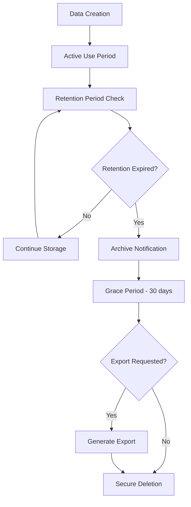

# Data Governance and Retention Policies

## Overview

This document outlines the comprehensive data governance framework for MyTapTrack, including data classification, retention policies, privacy controls, and compliance requirements. The governance model ensures responsible data stewardship while supporting operational and analytical needs.

## Data Classification Framework

### Classification Levels

#### Level 1: Public Data
**Definition**: Information that can be freely shared without risk to individuals or the organization.

**Examples**:
- System documentation
- Public API specifications
- General product information
- Anonymized usage statistics

**Controls**:
- Standard encryption in transit
- Basic access logging
- No special retention requirements

#### Level 2: Internal Data
**Definition**: Information intended for internal use that could cause minor harm if disclosed.

**Examples**:
- System configurations
- Operational metrics
- Aggregated analytics (non-personal)
- License feature configurations

**Controls**:
- Encryption at rest and in transit
- Role-based access control
- Standard audit logging
- 7-year retention unless specified otherwise

#### Level 3: Confidential Data
**Definition**: Sensitive business information that could cause significant harm if disclosed.

**Examples**:
- Customer license details
- Financial information
- Strategic business data
- Detailed system architecture

**Controls**:
- Strong encryption with managed keys
- Strict access controls with approval workflows
- Comprehensive audit logging
- 7-year retention with secure disposal

#### Level 4: Restricted Data (PII/PHI)
**Definition**: Personally identifiable information and protected health information requiring the highest level of protection.

**Examples**:
- Student names and identification
- Behavioral tracking data
- Medical/therapeutic information
- User contact information
- Device location data

**Controls**:
- Customer-managed KMS encryption
- Multi-factor authentication required
- Detailed audit trails with integrity protection
- License-specific retention policies
- Data minimization and purpose limitation

## Data Retention Policies

### Retention Framework

#### License-Based Retention
Each license defines specific retention periods based on organizational requirements and regulatory compliance needs.

**Standard Retention Periods**:
- **Educational Licenses**: 7 years from student graduation or data creation
- **Healthcare Licenses**: 10 years from last treatment or as required by state law
- **Research Licenses**: As specified in research protocol, typically 5-10 years
- **Personal Licenses**: 3 years from account closure or as requested by user

#### Entity-Specific Retention

##### User Data
- **Account Information**: Retained for license duration + 1 year
- **Authentication Logs**: 2 years
- **Activity Logs**: 1 year
- **Personal Preferences**: Deleted within 30 days of account closure

##### Student Data
- **Behavioral Data**: License-specific retention period
- **Personal Information**: License-specific retention period
- **Academic Records**: Follow institutional policies (typically 7+ years)
- **Medical Information**: Follow healthcare regulations (typically 10+ years)

##### Device Data
- **Configuration Data**: 3 years from device deregistration
- **Operational Logs**: 1 year
- **Calibration Data**: 5 years for compliance purposes

##### System Data
- **Application Logs**: 90 days
- **Security Logs**: 2 years
- **Performance Metrics**: 1 year
- **Error Logs**: 6 months

### Automated Retention Management

#### Data Lifecycle Automation


#### Implementation Components
- **Scheduled Lambda Functions**: Daily retention policy evaluation
- **DynamoDB TTL**: Automatic item expiration for time-sensitive data
- **S3 Lifecycle Policies**: Automated archival and deletion
- **EventBridge Rules**: Retention event orchestration
- **SNS Notifications**: Stakeholder alerts for retention actions

## Privacy Controls

### Data Minimization

#### Collection Principles
- **Purpose Limitation**: Data collected only for specified, legitimate purposes
- **Necessity Test**: Regular evaluation of data collection requirements
- **Proportionality**: Data collection proportionate to intended use
- **Accuracy Maintenance**: Processes to ensure data accuracy and completeness

#### Implementation Measures
- Schema validation to prevent unnecessary data collection
- Regular data audits to identify unused or excessive data
- Automated data quality checks and correction workflows
- User consent management for optional data collection

### Access Controls

#### Role-Based Access Control (RBAC)
```typescript
interface AccessLevel {
    read: boolean;
    write: boolean;
    delete: boolean;
    export: boolean;
    admin: boolean;
}

interface UserPermissions {
    data: AccessLevel;
    schedules: AccessLevel;
    devices: AccessLevel;
    team: AccessLevel;
    comments: AccessLevel;
    behavior: AccessLevel;
    notifications: AccessLevel;
    abc: AccessLevel;
    behaviors: string[];  // Specific behavior IDs
    milestones: AccessLevel;
    reports: AccessLevel;
    documents: AccessLevel;
    reportsOverride: boolean;
    transferLicense: boolean;
}
```

#### Permission Inheritance
- **License Level**: Base permissions defined by license features
- **Student Level**: Per-student permission overrides
- **Team Role**: Role-based permission templates
- **Individual**: Specific user permission customizations

### Consent Management

#### Consent Types
- **Data Collection**: Initial consent for data gathering
- **Data Processing**: Consent for specific processing activities
- **Data Sharing**: Consent for sharing with team members or third parties
- **Marketing Communications**: Opt-in consent for non-essential communications

#### Consent Tracking
```typescript
interface ConsentRecord {
    userId: string;
    studentId?: string;
    consentType: ConsentType;
    granted: boolean;
    timestamp: number;
    version: string;
    ipAddress?: string;
    userAgent?: string;
    withdrawalDate?: number;
}
```

## Compliance Framework

### Regulatory Compliance

#### FERPA (Family Educational Rights and Privacy Act)
- **Scope**: Educational records for students under 18
- **Requirements**: 
  - Parental consent for disclosure
  - Right to inspect and review records
  - Right to request amendment of inaccurate records
  - Annual notification of rights

**Implementation**:
- Parental consent workflows for team member additions
- Student record export functionality
- Data correction request processing
- Annual privacy notice distribution

#### HIPAA (Health Insurance Portability and Accountability Act)
- **Scope**: Protected health information in healthcare settings
- **Requirements**:
  - Administrative, physical, and technical safeguards
  - Business associate agreements
  - Breach notification procedures
  - Individual rights to access and amend PHI

**Implementation**:
- Encryption and access controls for PHI
- Business associate agreements with AWS
- Automated breach detection and notification
- Patient access portals for data review

#### COPPA (Children's Online Privacy Protection Act)
- **Scope**: Online services directed to children under 13
- **Requirements**:
  - Verifiable parental consent
  - Limited data collection
  - No behavioral advertising to children
  - Parental access and deletion rights

**Implementation**:
- Age verification workflows
- Parental consent management
- Restricted data collection for minors
- Parental control interfaces

### International Compliance

#### GDPR (General Data Protection Regulation)
- **Scope**: EU residents' personal data
- **Requirements**:
  - Lawful basis for processing
  - Data subject rights (access, rectification, erasure, portability)
  - Privacy by design and default
  - Data protection impact assessments

**Implementation**:
- Consent management system
- Data subject request automation
- Privacy-preserving system design
- Regular privacy impact assessments

## Data Security Measures

### Encryption Standards

#### Data at Rest
- **Primary Table**: Customer-managed KMS keys with annual rotation
- **Data Table**: AWS-managed encryption with audit logging
- **S3 Storage**: Server-side encryption with KMS integration
- **Backup Data**: Encrypted with separate key hierarchy

#### Data in Transit
- **API Communications**: TLS 1.3 with certificate pinning
- **Database Connections**: Encrypted connections with certificate validation
- **Inter-service Communication**: VPC endpoints with encryption
- **Client Applications**: End-to-end encryption for sensitive operations

### Access Monitoring

#### Audit Logging
```typescript
interface AuditLogEntry {
    timestamp: number;
    userId: string;
    action: string;
    resource: string;
    resourceId: string;
    sourceIP: string;
    userAgent: string;
    result: 'success' | 'failure' | 'unauthorized';
    details?: Record<string, any>;
}
```

#### Monitoring Alerts
- **Unusual Access Patterns**: Machine learning-based anomaly detection
- **Bulk Data Access**: Alerts for large-scale data retrieval
- **Administrative Actions**: Real-time notifications for sensitive operations
- **Failed Authentication**: Automated response to repeated failures

## Data Quality Management

### Quality Dimensions

#### Accuracy
- **Validation Rules**: Schema-based validation at data entry
- **Cross-Reference Checks**: Consistency validation across related entities
- **User Feedback**: Mechanisms for reporting and correcting inaccuracies
- **Automated Correction**: Rules-based correction for common errors

#### Completeness
- **Required Field Validation**: Enforcement of mandatory data elements
- **Relationship Integrity**: Validation of entity relationships
- **Missing Data Detection**: Automated identification of incomplete records
- **Data Enrichment**: Processes to supplement missing information

#### Consistency
- **Format Standardization**: Consistent data formats across the system
- **Reference Data Management**: Centralized management of lookup values
- **Cross-System Synchronization**: Consistency across integrated systems
- **Temporal Consistency**: Validation of time-based data relationships

#### Timeliness
- **Real-time Processing**: Immediate processing of critical data updates
- **Batch Processing Windows**: Defined schedules for non-critical updates
- **Data Freshness Monitoring**: Tracking of data age and staleness
- **Update Notification**: Alerts for time-sensitive data changes

## Governance Processes

### Data Stewardship

#### Roles and Responsibilities
- **Data Owner**: Business stakeholder responsible for data governance decisions
- **Data Steward**: Technical role responsible for data quality and compliance
- **Data Custodian**: Operational role responsible for data storage and security
- **Privacy Officer**: Responsible for privacy compliance and risk management

#### Governance Committees
- **Data Governance Board**: Strategic oversight and policy decisions
- **Privacy Review Committee**: Privacy impact assessment and compliance
- **Security Review Board**: Security architecture and incident response
- **Quality Assurance Team**: Data quality monitoring and improvement

### Policy Management

#### Policy Lifecycle
1. **Policy Development**: Stakeholder input and regulatory analysis
2. **Review and Approval**: Multi-level review and formal approval process
3. **Implementation**: System configuration and process deployment
4. **Monitoring**: Compliance monitoring and effectiveness measurement
5. **Review and Update**: Regular policy review and update cycles

#### Change Management
- **Impact Assessment**: Evaluation of policy changes on systems and processes
- **Stakeholder Communication**: Notification and training for policy changes
- **Phased Implementation**: Gradual rollout of significant policy changes
- **Rollback Procedures**: Processes for reverting problematic changes

This governance framework ensures that MyTapTrack maintains the highest standards of data protection while supporting its mission to provide valuable behavioral tracking and analysis capabilities.