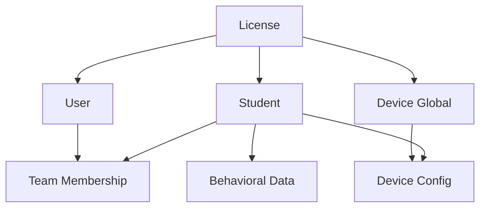

# Logical Data Model

## Overview

The logical data model translates the conceptual entities into a structure optimized for DynamoDB's NoSQL architecture. The design uses a dual-table approach with strategic denormalization and access pattern optimization.

## Table Architecture

### Primary Table (`mytaptrack-{env}-primary`)
Stores personally identifiable information (PII) and sensitive data with enhanced encryption.

**Partition Strategy**: Entity-based partitioning with hierarchical sort keys
**Encryption**: Customer-managed KMS keys with strict access controls
**Access Patterns**: Point lookups and small-range queries for sensitive data

### Data Table (`mytaptrack-{env}-data`)
Stores behavioral data, configurations, and operational information with optimized access patterns.

**Partition Strategy**: Multi-access pattern design with GSI support
**Encryption**: AWS-managed encryption with audit logging
**Access Patterns**: Complex queries, time-series access, and bulk operations

## Key Design Patterns

### Composite Key Structure
```
PK (Partition Key): Entity type + Primary identifier
SK (Sort Key): Sub-entity type + Secondary identifier + Timestamp
```

### Global Secondary Indexes (GSI)
- **License Index**: Access patterns by license for multi-tenancy
- **Student Index**: Student-centric data access across entity types
- **Device Index**: Device-specific configurations and data
- **App Index**: Mobile application data organization

## Entity Mappings

### User Entity

#### Primary Table Storage
```typescript
interface UserPrimaryStorage {
    pk: string;           // "U#{userId}"
    sk: string;           // "P"
    userId: string;
    email: string;
    firstName: string;
    lastName: string;
    state: string;
    zip: string;
    license: string;
    version: number;
    terms: string;
    lastLogin?: number;
}
```

#### Data Table Storage
```typescript
interface UserDataStorage {
    pk: string;           // "U#{userId}"
    sk: string;           // "D"
    userId: string;
    license: string;
    preferences: UserPreferences;
    notifications: UserNotifications;
    subscriptions: BehaviorSubscription[];
    version: number;
}
```

#### Access Patterns
- Get user by ID: `PK = "U#{userId}" AND SK = "P"`
- Get user data: `PK = "U#{userId}" AND SK = "D"`
- List users by license: `GSI-License: lpk = "L#{license}#U" AND lsk begins_with "U#"`

### Student Entity

#### Primary Table Storage (PII)
```typescript
interface StudentPiiStorage {
    pk: string;           // "S#{studentId}"
    sk: string;           // "P"
    studentId: string;
    firstName: string;
    lastName: string;
    nickname?: string;
    license: string;
    tags: string[];
    behaviorLookup: BehaviorMapping[];
    responseLookup: ResponseMapping[];
    servicesLookup: ServiceMapping[];
    milestones: Milestone[];
    version: number;
}
```

#### Data Table Storage (Configuration)
```typescript
interface StudentConfigStorage {
    pk: string;           // "S#{studentId}"
    sk: string;           // "C"
    studentId: string;
    license: string;
    behaviors: StudentBehavior[];
    responses: StudentResponse[];
    services: StudentService[];
    documents: StudentDocument[];
    scheduleCategories: ScheduleCategory[];
    dashboard: StudentDashboardSettings;
    restrictions: UserSummaryRestrictions;
    absences: StudentAbsence[];
    version: number;
    lastTracked: string;
    lastUpdateDate: string;
    archived?: boolean;
}
```

#### Access Patterns
- Get student PII: `PK = "S#{studentId}" AND SK = "P"`
- Get student config: `PK = "S#{studentId}" AND SK = "C"`
- List students by license: `GSI-License: lpk = "L#{license}#S" AND lsk begins_with "S#"`
- Query student data: `GSI-Student: studentId = "{studentId}"`

### Device Entity

#### Primary Table Storage (Global Device Info)
```typescript
interface DevicePiiGlobalStorage {
    pk: string;           // "D#{deviceId}"
    sk: string;           // "G"
    deviceId: string;
    name: string;
    license: string;
    currentStudentId?: string;
    validated: boolean;
    termSetup: boolean;
    commands: CommandSwitchStudent[];
    version: number;
}
```

#### Data Table Storage (Student-Specific Config)
```typescript
interface DeviceConfigStorage {
    pk: string;           // "ST#{studentId}#D"
    sk: string;           // "D#{deviceId}"
    studentId: string;
    deviceId: string;
    license: string;
    timezone: string;
    config: {
        behaviors: DeviceBehaviorMapping[];
    };
    deleted?: boolean;
    version: number;
}
```

#### Access Patterns
- Get device global info: `PK = "D#{deviceId}" AND SK = "G"`
- Get student devices: `PK = "ST#{studentId}#D"`
- Get device by student: `GSI-Device: deviceId = "{deviceId}"`
- List devices by license: `GSI-License: lpk = "L#{license}#D"`

### Behavioral Data Entity

#### Data Table Storage
```typescript
interface BehaviorDataStorage {
    pk: string;           // "S#{studentId}#D#{weekStart}"
    sk: string;           // "D#{timestamp}#{behaviorId}"
    studentId: string;
    dateEpoch: number;
    behavior: string;
    duration?: number;
    intensity?: number;
    isManual: boolean;
    source?: {
        device: string;
        rater?: string;
    };
    abc?: {
        a: string;
        c: string;
    };
    deleted?: {
        date: string;
        by: string;
    };
    reported?: boolean;
    score?: number;
}
```

#### Access Patterns
- Get week data: `PK = "S#{studentId}#D#{weekStart}"`
- Query time range: `PK = "S#{studentId}#D#{weekStart}" AND SK BETWEEN "D#{start}" AND "D#{end}"`
- Student time series: `GSI-Student: studentId = "{studentId}" AND tsk begins_with "D#"`

### License Entity

#### Primary Table Storage
```typescript
interface LicenseStorage {
    pk: string;           // "L#{licenseId}"
    sk: string;           // "P"
    license: string;
    customer: string;
    singleCount: number;
    singleUsed: number;
    multiCount: number;
    appLimit?: number;
    serviceCount?: number;
    admins: string[];
    emailDomain: string;
    start: string;
    expiration: string;
    features: LicenseFeatures;
    tags: {
        devices: LicenseTagSet[];
    };
    abcCollections?: AbcCollection[];
    mobileTemplates?: LicenseAppTemplate[];
    studentTemplates?: LicenseStudentTemplate[];
    version: number;
}
```

#### Access Patterns
- Get license: `PK = "L#{licenseId}" AND SK = "P"`
- List all licenses: `Scan` with pagination

## Global Secondary Index Definitions

### License Index (`License`)
```
Partition Key: lpk (License Partition Key)
Sort Key: lsk (License Sort Key)
Projection: ALL
```

**Key Patterns:**
- Users by license: `lpk = "L#{license}#U", lsk = "U#{userId}"`
- Students by license: `lpk = "L#{license}#S", lsk = "S#{studentId}"`
- Devices by license: `lpk = "L#{license}#D", lsk = "D#{deviceId}"`

### Student Index (`Student`)
```
Partition Key: studentId
Sort Key: tsk (Time Sort Key)
Projection: ALL
```

**Key Patterns:**
- Student behavioral data: `studentId = "{studentId}", tsk = "D#{timestamp}"`
- Student configurations: `studentId = "{studentId}", tsk = "C"`
- Student team members: `studentId = "{studentId}", tsk = "T#{userId}"`

### Device Index (`Device`)
```
Partition Key: deviceId
Sort Key: dsk (Device Sort Key)
Projection: ALL
```

**Key Patterns:**
- Device configurations: `deviceId = "{deviceId}", dsk = "S#{studentId}"`
- Device data: `deviceId = "{deviceId}", dsk = "D#{timestamp}"`

### App Index (`App`)
```
Partition Key: appId
Sort Key: deviceId
Projection: ALL
```

**Key Patterns:**
- App device mappings: `appId = "{appId}"`
- App configurations: `appId = "{appId}", deviceId = "{deviceId}"`

## Data Relationships and Referential Integrity

### Parent-Child Relationships


### Cross-Reference Patterns
- **User-Student**: Team membership records in data table
- **Student-Device**: Configuration records with student and device IDs
- **License-Entity**: License ID embedded in all related entities
- **Behavioral Data-Student**: Student ID as partition key component

## Data Consistency Patterns

### Strong Consistency
- User authentication data
- License validation
- Device registration
- Critical configuration changes

### Eventual Consistency
- Behavioral data aggregations
- Report generation
- Cross-region replication
- Analytics and metrics

### Optimistic Concurrency
- Version numbers on all mutable entities
- Conditional updates for critical operations
- Conflict resolution through timestamps
- Retry logic for concurrent modifications

## Query Optimization Strategies

### Hot Partition Mitigation
- Time-based partitioning for behavioral data
- License-based distribution for multi-tenant access
- Composite keys to distribute load
- GSI design to avoid hot partitions

### Access Pattern Optimization
- Denormalization for common read patterns
- Precomputed aggregations for reports
- Batch operations for bulk data access
- Projection optimization in GSIs

### Performance Considerations
- Item size optimization (< 400KB recommended)
- Batch size limits (25 items for batch operations)
- Query result limits (1MB per query)
- GSI eventual consistency implications

## Data Migration and Evolution

### Schema Versioning
- Version numbers on all entity types
- Backward compatibility for schema changes
- Migration functions for data transformation
- Gradual rollout of schema updates

### Data Transformation Patterns
- EventBridge-driven data propagation
- Lambda functions for real-time processing
- Batch jobs for historical data migration
- Validation and error handling workflows

This logical model provides the foundation for implementing efficient data access patterns while maintaining data integrity and supporting the system's scalability requirements.