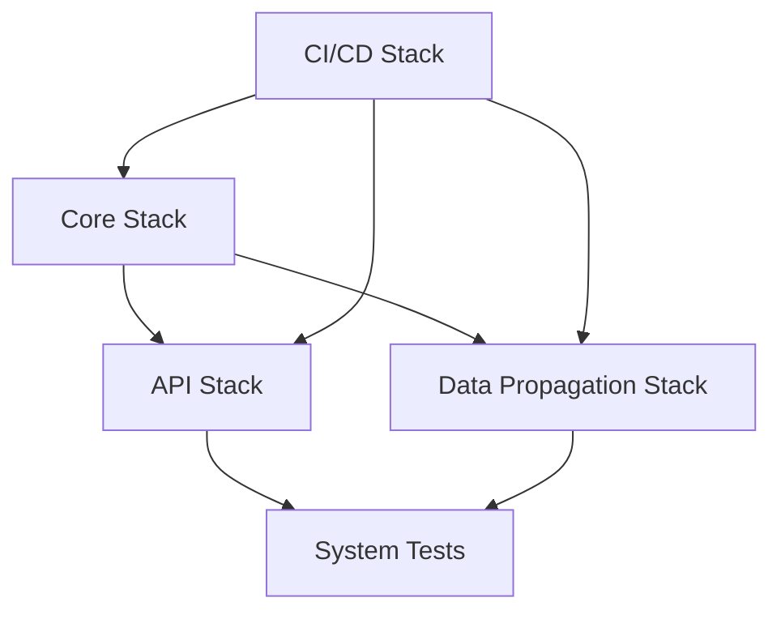

# Deployment Architecture

## Overview

MyTapTrack uses a multi-stack AWS CDK deployment pattern that enables modular development, independent deployments, and environment-specific configurations. The deployment architecture follows infrastructure-as-code principles with automated CI/CD pipelines.

## Multi-Stack Architecture

### Stack Organization

```
MyTapTrack Deployment
├── Core Stack (Foundation)
│   ├── DynamoDB Tables
│   ├── S3 Buckets
│   ├── Cognito User Pools
│   ├── EventBridge Custom Bus
│   └── KMS Keys
├── API Stack (Services)
│   ├── AppSync GraphQL API
│   ├── API Gateway REST APIs
│   ├── Lambda Functions
│   └── Device Communication APIs
├── Data Propagation Stack (Processing)
│   ├── EventBridge Rules
│   ├── Lambda Event Processors
│   ├── SQS Queues
│   └── SNS Topics
└── CI/CD Stack (Pipeline)
    ├── CodePipeline
    ├── CodeBuild Projects
    ├── S3 Artifact Buckets
    └── IAM Roles
```

### Stack Dependencies



## CDK Deployment Pattern

### Project Structure
```
/
├── types/          # Shared TypeScript definitions
├── cdk/            # Reusable CDK constructs
├── lib/            # Shared business logic
├── core/           # Core infrastructure stack
├── api/            # API services stack
├── data-prop/      # Data propagation stack
├── cicd/           # CI/CD pipeline stack
└── system-tests/   # Integration testing
```

### Build Dependencies
1. **types** → Foundation type definitions
2. **cdk** → Reusable infrastructure constructs
3. **lib** → Shared business logic and utilities
4. **core** → Core infrastructure deployment
5. **api** → API services deployment
6. **data-prop** → Data processing deployment
7. **system-tests** → End-to-end validation

### CDK Configuration

#### Core Stack (`/core`)
**Purpose**: Foundation infrastructure and shared resources
**Components**:
- DynamoDB tables with GSIs and streams
- S3 buckets for data lake and static assets
- Cognito User Pools and Identity Pools
- EventBridge custom event bus
- KMS keys for encryption
- CloudWatch log groups and alarms

**CDK Configuration** (`core/cdk.json`):
```json
{
  "app": "npx ts-node --prefer-ts-exts bin/core.ts",
  "requireApproval": "never",
  "context": {
    "@aws-cdk/aws-lambda:recognizeLayerVersion": true,
    "@aws-cdk/core:enableStackNameDuplicates": true,
    "aws-cdk:enableDiffNoFail": true
  }
}
```

#### API Stack (`/api`)
**Purpose**: API services and Lambda functions
**Components**:
- AppSync GraphQL API with resolvers
- API Gateway REST APIs for device communication
- Lambda functions for business logic
- Lambda layers for shared dependencies
- CloudFront distribution for API acceleration

**Deployment Features**:
- Environment-specific API configurations
- Automatic schema validation and deployment
- Lambda function versioning and aliases
- API throttling and rate limiting configuration

#### Data Propagation Stack (`/data-prop`)
**Purpose**: Event-driven data processing
**Components**:
- EventBridge rules and targets
- Lambda functions for event processing
- SQS queues for reliable message processing
- SNS topics for notifications
- Timestream database for time-series data

**Processing Patterns**:
- Real-time event processing
- Batch data processing workflows
- Dead letter queue handling
- Event replay capabilities

## Environment Management

### Environment Configuration

#### Configuration Hierarchy
```
config/
├── dev.yml           # Development environment
├── test.yml          # Testing environment
├── prod.yml          # Production environment
├── dev-min.yml       # Minimal development setup
└── example_*.yml     # Template configurations
```

#### Configuration Inheritance
```
Base Configuration
├── Environment Specific (dev.yml)
├── Region Specific (dev.us-east-1.yml)
└── Stack Specific Overrides
```

### Environment Variables

#### CDK Context Variables
- `STAGE`: Environment identifier (dev, test, prod)
- `REGION`: AWS region for deployment
- `ACCOUNT`: AWS account ID
- `CONFIG_FILE`: Configuration file path

#### Runtime Environment Variables
- Database table names and ARNs
- API endpoint URLs
- EventBridge bus ARNs
- S3 bucket names
- Cognito User Pool IDs

### Deployment Commands

#### Full Environment Deployment
```bash
# Install dependencies and deploy all stacks
make install STAGE=dev

# Deploy to specific region
make install STAGE=prod REGION=us-west-2
```

#### Individual Stack Deployment
```bash
# Deploy core infrastructure
make deploy-core STAGE=dev

# Deploy API services
make deploy-api STAGE=dev

# Deploy data propagation
make deploy-data-prop STAGE=dev
```

#### Environment Management
```bash
# Set up environment variables
make set-env STAGE=dev

# Configure environment settings
make configure-env STAGE=dev

# Clean up environment
make del-env STAGE=dev
```

## CI/CD Pipeline Architecture

### Pipeline Stages

#### 1. Source Stage
- **Trigger**: Git push to main branch
- **Source**: GitHub repository
- **Artifacts**: Source code and configuration files

#### 2. Build Stage
- **Environment**: CodeBuild with Node.js 18
- **Actions**:
  - Install dependencies (`npm ci`)
  - Run TypeScript compilation
  - Execute unit tests with coverage
  - Run security scans (npm audit)
  - Build CDK assets

#### 3. Test Stage
- **Environment**: Dedicated test AWS account
- **Actions**:
  - Deploy to test environment
  - Run integration tests
  - Execute system tests
  - Performance testing
  - Security testing

#### 4. Production Deployment
- **Environment**: Production AWS account
- **Actions**:
  - Manual approval gate
  - Blue/green deployment strategy
  - Health checks and monitoring
  - Rollback capabilities

### Build Specification (`buildspec.yml`)
```yaml
version: 0.2
phases:
  install:
    runtime-versions:
      nodejs: 18
    commands:
      - npm ci
  pre_build:
    commands:
      - npm run lint
      - npm audit --audit-level moderate
  build:
    commands:
      - make build
      - make test
      - cdk synth
  post_build:
    commands:
      - make deploy STAGE=$STAGE
artifacts:
  files:
    - '**/*'
  name: MyTapTrack-$(date +%Y-%m-%d)
```

## Cross-Region Deployment

### Multi-Region Strategy
- **Primary Region**: us-east-1 (N. Virginia)
- **Secondary Region**: us-west-2 (Oregon)
- **Data Replication**: DynamoDB Global Tables
- **Failover**: Route 53 health checks and DNS failover

### Regional Configuration
```yaml
# config/prod.us-east-1.yml
region: us-east-1
primary: true
globalTables: true
crossRegionReplication: true

# config/prod.us-west-2.yml
region: us-west-2
primary: false
globalTables: true
crossRegionReplication: true
```

## Security Deployment Patterns

### IAM Role Strategy
- **Deployment Roles**: Cross-account deployment permissions
- **Execution Roles**: Runtime service permissions
- **Developer Roles**: Limited development environment access
- **Operations Roles**: Production monitoring and maintenance

### Secrets Management
- **AWS Systems Manager Parameter Store**: Configuration parameters
- **AWS Secrets Manager**: Database credentials and API keys
- **Environment Variables**: Non-sensitive configuration
- **KMS Encryption**: All secrets encrypted at rest

### Network Security
- **VPC Configuration**: Private subnets for sensitive resources
- **Security Groups**: Restrictive inbound/outbound rules
- **NACLs**: Network-level access control
- **WAF**: Web application firewall for public APIs

## Monitoring and Observability

### Deployment Monitoring
- **CloudWatch Dashboards**: Real-time deployment metrics
- **X-Ray Tracing**: Request tracing across services
- **CloudTrail**: API call auditing and compliance
- **Config Rules**: Infrastructure compliance monitoring

### Alerting Strategy
- **Critical Alerts**: Immediate notification for service failures
- **Warning Alerts**: Performance degradation notifications
- **Info Alerts**: Deployment completion and status updates
- **Escalation**: Automated escalation for unresolved issues

## Disaster Recovery

### Backup Strategy
- **DynamoDB**: Point-in-time recovery and on-demand backups
- **S3**: Cross-region replication and versioning
- **Lambda**: Source code in version control
- **Configuration**: Infrastructure as code in Git

### Recovery Procedures
- **RTO (Recovery Time Objective)**: 4 hours
- **RPO (Recovery Point Objective)**: 1 hour
- **Automated Failover**: DNS-based traffic routing
- **Manual Procedures**: Step-by-step recovery documentation

### Testing Strategy
- **Monthly**: Disaster recovery testing in non-production
- **Quarterly**: Full cross-region failover testing
- **Annual**: Complete disaster recovery simulation
- **Documentation**: Updated procedures and lessons learned