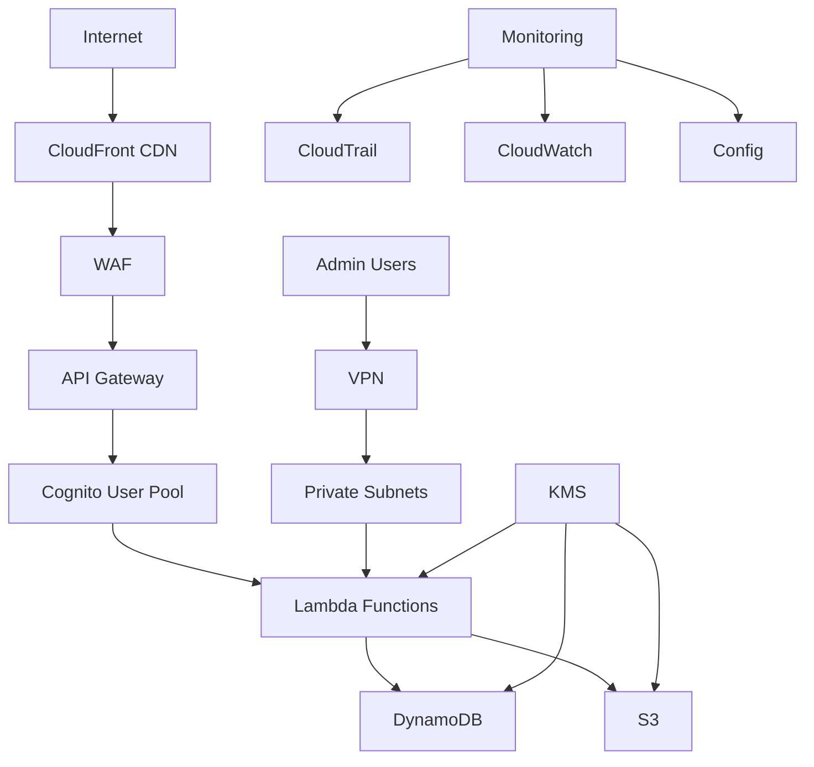
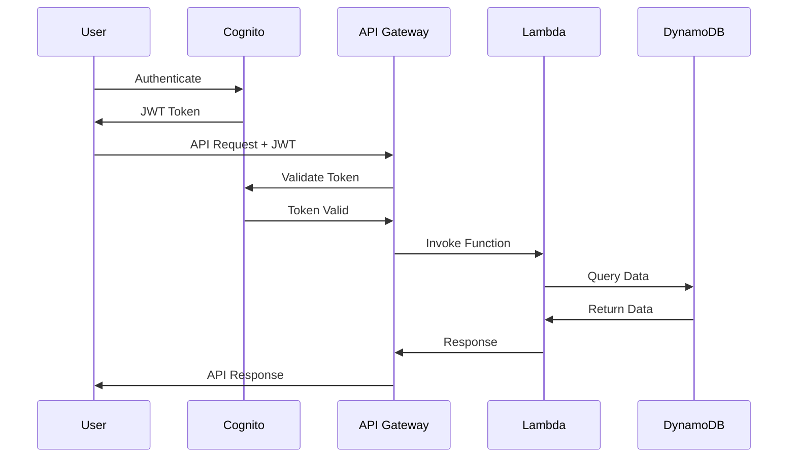

# Security Architecture

## Overview

MyTapTrack implements a comprehensive security architecture following AWS Well-Architected Framework security principles. The security model encompasses identity and access management, data protection, infrastructure security, and compliance requirements.

## Security Principles

### Defense in Depth
- **Multiple Security Layers**: Network, application, and data-level security controls
- **Fail-Safe Defaults**: Deny-by-default access policies
- **Least Privilege**: Minimal required permissions for all entities
- **Zero Trust**: Verify every request regardless of source

### Security by Design
- **Built-in Security**: Security controls integrated into architecture
- **Automated Security**: Continuous security monitoring and response
- **Compliance Ready**: Designed for regulatory compliance requirements
- **Incident Response**: Automated detection and response capabilities

## Identity and Access Management

### Authentication Architecture

#### AWS Cognito User Pools
**Purpose**: Primary user authentication service
**Configuration**:
- Multi-factor authentication (MFA) support
- Password policies with complexity requirements
- Account lockout and breach detection
- Social identity provider integration

```json
{
  "passwordPolicy": {
    "minimumLength": 12,
    "requireUppercase": true,
    "requireLowercase": true,
    "requireNumbers": true,
    "requireSymbols": true,
    "temporaryPasswordValidityDays": 1
  },
  "mfaConfiguration": "OPTIONAL",
  "mfaMethods": ["SMS", "TOTP"],
  "accountRecoverySetting": {
    "recoveryMechanisms": [
      {"name": "verified_email", "priority": 1},
      {"name": "verified_phone_number", "priority": 2}
    ]
  }
}
```

#### Identity Federation
- **SAML 2.0**: Enterprise identity provider integration
- **OpenID Connect**: Modern identity provider support
- **Social Providers**: Google, Facebook, Apple integration
- **Custom Authentication**: Lambda-based custom auth flows

### Authorization Architecture

#### Role-Based Access Control (RBAC)
```typescript
interface UserRole {
  roleId: string;
  roleName: 'admin' | 'teacher' | 'student' | 'parent' | 'support';
  permissions: Permission[];
  resourceAccess: ResourceAccess[];
}

interface Permission {
  action: string;           // 'read', 'write', 'delete', 'admin'
  resource: string;         // 'users', 'devices', 'reports', 'settings'
  conditions?: Condition[]; // Additional access conditions
}

interface ResourceAccess {
  resourceType: string;     // 'organization', 'school', 'classroom'
  resourceId: string;       // Specific resource identifier
  accessLevel: 'owner' | 'member' | 'viewer';
}
```

#### IAM Roles and Policies

##### Service Execution Roles
```json
{
  "Version": "2012-10-17",
  "Statement": [
    {
      "Effect": "Allow",
      "Action": [
        "dynamodb:GetItem",
        "dynamodb:PutItem",
        "dynamodb:UpdateItem",
        "dynamodb:Query"
      ],
      "Resource": [
        "arn:aws:dynamodb:*:*:table/${aws:PrincipalTag/Environment}-mytaptrack-*",
        "arn:aws:dynamodb:*:*:table/${aws:PrincipalTag/Environment}-mytaptrack-*/index/*"
      ],
      "Condition": {
        "StringEquals": {
          "aws:PrincipalTag/Environment": "${aws:RequestedRegion}"
        }
      }
    }
  ]
}
```

##### Cross-Service Access Policies
- **Lambda Execution**: DynamoDB, S3, EventBridge access
- **AppSync Resolvers**: Lambda function invocation
- **EventBridge Rules**: Lambda and SNS target permissions
- **CloudWatch Logging**: Log group creation and writing

#### Fine-Grained Authorization

##### GraphQL Field-Level Security
```graphql
type User @aws_auth(cognito_groups: ["admin", "teacher"]) {
  id: ID!
  email: String!
  personalInfo: PersonalInfo @aws_auth(cognito_groups: ["admin"])
  devices: [Device] @aws_auth(cognito_groups: ["admin", "teacher", "parent"])
}
```

##### API Gateway Authorizers
- **Cognito Authorizer**: JWT token validation
- **Lambda Authorizer**: Custom authorization logic
- **API Key Authorization**: Service-to-service authentication
- **Resource-Based Policies**: IP-based access control

## Data Protection

### Encryption Architecture

#### Encryption at Rest
- **DynamoDB**: Server-side encryption with AWS managed keys
- **S3**: AES-256 encryption with customer-managed KMS keys
- **Lambda**: Environment variable encryption
- **CloudWatch Logs**: Log group encryption with KMS

#### Encryption in Transit
- **TLS 1.2+**: All API communications
- **Certificate Management**: AWS Certificate Manager integration
- **HTTPS Enforcement**: CloudFront and API Gateway configuration
- **Internal Communications**: VPC endpoint encryption

#### Key Management Strategy
```typescript
interface KMSKeyConfiguration {
  keyId: string;
  keyAlias: string;
  keyPolicy: {
    keyAdministrators: string[];    // IAM roles for key management
    keyUsers: string[];            // Services that can use the key
    keyRotation: boolean;          // Automatic key rotation
  };
  grants: KMSGrant[];             // Temporary access grants
}

interface KMSGrant {
  granteePrincipal: string;       // Service or role ARN
  operations: string[];           // Allowed operations
  constraints: {
    encryptionContext?: Record<string, string>;
    expirationDate?: Date;
  };
}
```

### Data Classification and Handling

#### Data Classification Levels
1. **Public**: Marketing materials, public documentation
2. **Internal**: Business data, operational metrics
3. **Confidential**: User data, device information
4. **Restricted**: PII, authentication credentials, payment data

#### Data Handling Requirements
```typescript
interface DataHandlingPolicy {
  classification: 'public' | 'internal' | 'confidential' | 'restricted';
  encryption: {
    atRest: boolean;
    inTransit: boolean;
    keyManagement: 'aws-managed' | 'customer-managed';
  };
  access: {
    authentication: boolean;
    authorization: boolean;
    logging: boolean;
    monitoring: boolean;
  };
  retention: {
    period: string;           // ISO 8601 duration
    archival: boolean;
    deletion: 'soft' | 'hard';
  };
  compliance: string[];       // GDPR, COPPA, FERPA, etc.
}
```

### Privacy and Compliance

#### GDPR Compliance
- **Data Minimization**: Collect only necessary data
- **Purpose Limitation**: Use data only for stated purposes
- **Right to Access**: User data export capabilities
- **Right to Erasure**: Data deletion and anonymization
- **Data Portability**: Structured data export formats
- **Consent Management**: Granular consent tracking

#### COPPA Compliance (Children's Privacy)
- **Age Verification**: Parental consent mechanisms
- **Data Collection Limits**: Minimal data collection for minors
- **Parental Controls**: Parent access to child data
- **Data Retention**: Automatic deletion of expired data
- **Third-Party Sharing**: Restricted data sharing policies

## Network Security

### VPC Architecture
```
MyTapTrack VPC (10.0.0.0/16)
├── Public Subnets (10.0.1.0/24, 10.0.2.0/24)
│   ├── NAT Gateways
│   └── Application Load Balancers
├── Private Subnets (10.0.10.0/24, 10.0.11.0/24)
│   ├── Lambda Functions
│   ├── RDS Instances (if used)
│   └── ElastiCache Clusters (if used)
└── Database Subnets (10.0.20.0/24, 10.0.21.0/24)
    └── DynamoDB VPC Endpoints
```

### Security Groups and NACLs

#### Security Group Rules
```json
{
  "securityGroupRules": [
    {
      "type": "ingress",
      "protocol": "tcp",
      "port": 443,
      "source": "0.0.0.0/0",
      "description": "HTTPS from internet"
    },
    {
      "type": "egress",
      "protocol": "tcp",
      "port": 443,
      "destination": "0.0.0.0/0",
      "description": "HTTPS to AWS services"
    }
  ]
}
```

#### Network ACL Configuration
- **Stateless Rules**: Explicit allow/deny rules
- **Subnet-Level Protection**: Additional network layer security
- **DDoS Protection**: Rate limiting and traffic filtering
- **Geo-Blocking**: Geographic access restrictions

### API Security

#### Rate Limiting and Throttling
```typescript
interface RateLimitConfiguration {
  burstLimit: number;        // Maximum concurrent requests
  rateLimit: number;         // Requests per second
  quotaLimit: number;        // Daily request quota
  quotaPeriod: 'DAY' | 'WEEK' | 'MONTH';
  throttleSettings: {
    burstLimit: number;
    rateLimit: number;
  };
}
```

#### API Gateway Security Features
- **AWS WAF Integration**: Web application firewall
- **Request Validation**: Schema-based request validation
- **Response Filtering**: Sensitive data removal
- **CORS Configuration**: Cross-origin resource sharing controls

#### GraphQL Security
- **Query Depth Limiting**: Prevent deeply nested queries
- **Query Complexity Analysis**: Computational cost limits
- **Rate Limiting**: Per-user and per-IP rate limits
- **Schema Introspection**: Disabled in production

## Application Security

### Secure Development Practices

#### Code Security Standards
- **Static Analysis**: ESLint security rules and SonarQube
- **Dependency Scanning**: npm audit and Snyk integration
- **Secret Detection**: GitLeaks and TruffleHog scanning
- **License Compliance**: Automated license compatibility checking

#### Security Testing
```typescript
interface SecurityTestSuite {
  staticAnalysis: {
    tools: ['eslint-plugin-security', 'sonarjs'];
    rules: string[];
    failureThreshold: 'high' | 'medium' | 'low';
  };
  dependencyScanning: {
    tools: ['npm-audit', 'snyk'];
    vulnerabilityThreshold: 'high' | 'medium' | 'low';
    autoFix: boolean;
  };
  dynamicTesting: {
    tools: ['owasp-zap', 'burp-suite'];
    testTypes: ['xss', 'sql-injection', 'csrf'];
    schedule: 'daily' | 'weekly' | 'monthly';
  };
}
```

### Runtime Security

#### Lambda Function Security
- **Execution Role**: Minimal required permissions
- **Environment Variables**: Encrypted sensitive configuration
- **VPC Configuration**: Network isolation when required
- **Resource Limits**: Memory and timeout constraints
- **Dead Letter Queues**: Error handling and monitoring

#### Container Security (if applicable)
- **Base Image Scanning**: Vulnerability assessment
- **Runtime Protection**: Container runtime security
- **Image Signing**: Trusted image verification
- **Resource Constraints**: CPU and memory limits

## Monitoring and Incident Response

### Security Monitoring

#### CloudTrail Configuration
```json
{
  "cloudTrail": {
    "isLogging": true,
    "includeGlobalServiceEvents": true,
    "isMultiRegionTrail": true,
    "enableLogFileValidation": true,
    "eventSelectors": [
      {
        "readWriteType": "All",
        "includeManagementEvents": true,
        "dataResources": [
          {
            "type": "AWS::DynamoDB::Table",
            "values": ["arn:aws:dynamodb:*:*:table/*"]
          },
          {
            "type": "AWS::S3::Object",
            "values": ["arn:aws:s3:::*/*"]
          }
        ]
      }
    ]
  }
}
```

#### Security Metrics and Alarms
- **Failed Authentication Attempts**: Brute force detection
- **Privilege Escalation**: Unusual permission changes
- **Data Access Patterns**: Anomalous data access
- **API Abuse**: Unusual API usage patterns
- **Infrastructure Changes**: Unauthorized resource modifications

### Incident Response

#### Automated Response Actions
```typescript
interface SecurityIncident {
  incidentId: string;
  severity: 'critical' | 'high' | 'medium' | 'low';
  type: 'authentication' | 'authorization' | 'data-breach' | 'infrastructure';
  detectionTime: Date;
  affectedResources: string[];
  automatedActions: ResponseAction[];
  escalationRequired: boolean;
}

interface ResponseAction {
  action: 'isolate' | 'disable' | 'rotate' | 'notify';
  target: string;
  executedAt: Date;
  success: boolean;
}
```

#### Incident Response Procedures
1. **Detection**: Automated monitoring and alerting
2. **Assessment**: Severity and impact evaluation
3. **Containment**: Immediate threat mitigation
4. **Investigation**: Root cause analysis
5. **Recovery**: Service restoration procedures
6. **Lessons Learned**: Post-incident review and improvements

## Compliance and Governance

### Compliance Framework

#### Regulatory Requirements
- **GDPR**: European data protection regulation
- **COPPA**: Children's online privacy protection
- **FERPA**: Educational records privacy (US)
- **SOC 2**: Security and availability controls
- **ISO 27001**: Information security management

#### Compliance Controls
```typescript
interface ComplianceControl {
  controlId: string;
  regulation: 'GDPR' | 'COPPA' | 'FERPA' | 'SOC2' | 'ISO27001';
  description: string;
  implementation: {
    technical: string[];      // Technical controls
    administrative: string[]; // Process controls
    physical: string[];       // Physical controls
  };
  testing: {
    frequency: 'continuous' | 'monthly' | 'quarterly' | 'annually';
    method: 'automated' | 'manual' | 'hybrid';
    evidence: string[];
  };
  status: 'implemented' | 'in-progress' | 'planned';
}
```

### Security Governance

#### Security Policies
- **Information Security Policy**: Overall security framework
- **Data Classification Policy**: Data handling requirements
- **Access Control Policy**: Identity and access management
- **Incident Response Policy**: Security incident procedures
- **Vendor Management Policy**: Third-party security requirements

#### Risk Management
```typescript
interface SecurityRisk {
  riskId: string;
  category: 'technical' | 'operational' | 'compliance' | 'strategic';
  description: string;
  likelihood: 'very-low' | 'low' | 'medium' | 'high' | 'very-high';
  impact: 'very-low' | 'low' | 'medium' | 'high' | 'very-high';
  riskScore: number;        // Calculated risk score
  mitigation: {
    controls: string[];     // Existing controls
    actions: string[];      // Additional actions needed
    owner: string;          // Risk owner
    dueDate: Date;         // Mitigation deadline
  };
  status: 'open' | 'mitigated' | 'accepted' | 'transferred';
}
```

## Security Architecture Diagrams

### High-Level Security Architecture


### Identity and Access Flow


## Performance and Security Trade-offs

### Security vs. Performance Considerations
- **Encryption Overhead**: Minimal impact with hardware acceleration
- **Authentication Latency**: Token caching and validation optimization
- **Authorization Complexity**: Efficient policy evaluation algorithms
- **Monitoring Overhead**: Sampling and aggregation strategies

### Optimization Strategies
- **Connection Pooling**: Secure connection reuse
- **Caching**: Security-aware caching strategies
- **Compression**: Encrypted data compression
- **CDN Integration**: Security header propagation